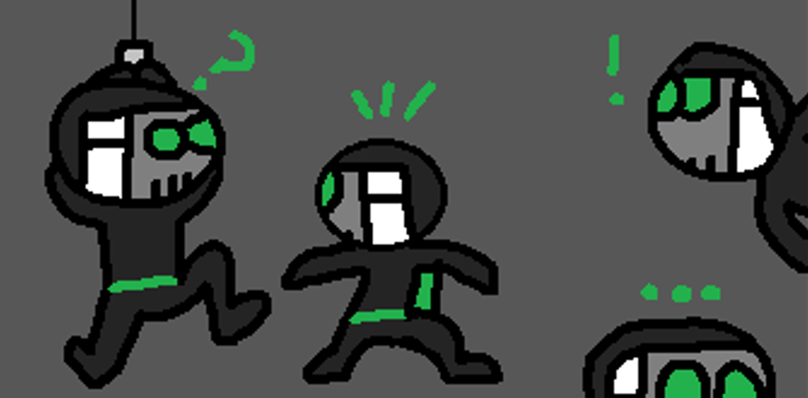

# My programmer profile (or something like that)

It is a bit complicated to make me fit into a simple, short profile. Anyway, I am talking about
my "general" programmer story with some highlights, this is not about my GitHub profile \(for that,
you can go [here](http://github.com/DiddiLeija)\).

## Programming languages

- My first programming language: **Pascal**. Yeah, this obsolete language is, officially, the first programming language I learned.
- My favorite programming language: **Python**. Of course that I love Python!
- The hardest language \(for me\): **JavaScript**. JavaScript is hard for me when I use it on HTMLs \(without the amazing _Node.js_ tool\).
- The most unused language for me: **Pascal**. I just used it for something more than 2 months, and then I forgot it.
- All the languages I can use (to be specific, that I can use well):
  - Python
  - Pascal
  - Java
  - JavaScript
  - C++
  - Kotlin

## \(Real\) languages that I use for programming

\(I mean, spoken languages\).

- 70% **English**. Most of my public \(and private\) repositories are made in English.
- 30% **Spanish**. Even when it is my native language, I don't use it a lot for programming \(just with local projects\).
  However, I help some projects to translate docs to this language!

## Programming branches

Those that I use, _in order of preference_:

1. **Game development**. It's more a hobby than a job, but I love it
2. **Packaging**. Most of my public repos and my public contributions are about packages. I like making things that any other developer can download and use.
3. **GUIs**. I love making things that the others can see, you know.
4. **Web programming**. I'm not an expert at all, but I like it.
5. **Databases**. Well... I'm not a "huge fan" of doing databases, but I can do it.

_In order of usage_:

1. **Packaging**. I am currently working to find a way to improve [my existing packages around GitHub](http://github.com/DiddiLeija?tab=repositories).
2. **GUIs**. I make GUIs for my local community \(to help their jobs\).
3. **Game development**. I don't spend all my time in this, even when I love it.
4. **Databases**. I don't like them, but my community needs databases for their jobs.
5. **Web programming**. I create personal projects with JavaScript or just HTMLs.

## Organizations

Those organizations that I've joined, hosted in GitHub.

- **[@pypa](http://github.com/pypa)**: I am collaborating with [`pip`](http://pip.pypa.io) on [trivial changes](https://github.com/pypa/pip/issues?q=author%3ADiddiLeija) and I give attention to some issues from newcomer users. I think [@pypa](http://github.com/pypa) has strongly contributed to my programming progress. Now, I'm helping with some other [@pypa](http://github.com/pypa) repositories, too.

## Some important contributions

Some of my highest contributions.

- **[Pip](https://pip.pypa.io)**. As I said above, Pip was my first opportunity to contribute on an open source project.
- **[PyPA](https://pypa.io)**. I joined this authority to work on Pip, but then I've helped with other PyPA-regulated projects.
- **[Nox](https://nox.thea.codes)**. I'm currently one of the [maintainers of the project](https://nox.thea.codes/en/stable/#maintainers-contributors).

I'm glad to be in these projects, it's such an honor for me :)

****

## Fact: _Why "DiddiLeija"?_

Some people may ask: _"Who or what is 'Diddi'?", "Why are you using an image of a masked person in your profiles?"_, and _"Where does 'DiddiLeija' came from?"_
I'll give you the answers now.

I love programming, but I also like drawing: I like to draw and write comics.

One of my characters is named `Diddi`. He wears
a dark mask, black suit and a green backpack. On my comics, Diddi is a digital hero from the future, that hides himself from the rest of the people by using
a metal mask. I have to admit it: _I loved Diddi from the first time._

So, when I started to share code with the world, I decided to take the name, and I made some changes to it (I added "Leija", which is a spanish surname).
After that, "DiddiLeija" appears... To keep the personality of Diddi, I selected the Jekyll theme `hacker` for my website.

Now, I think you'll understand more things about me and this site, right?
